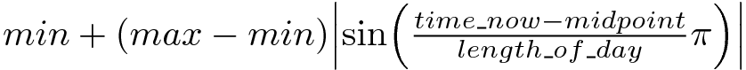
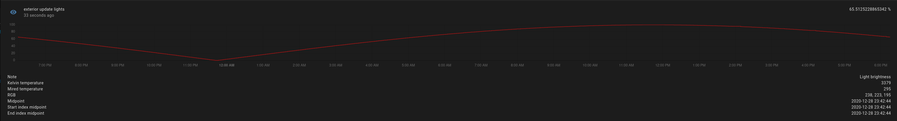
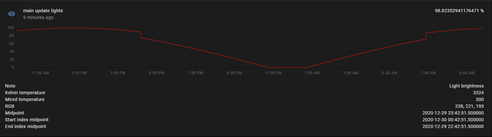

# Periodic lights

## Introduction

Periodic lights (formally update lights) is an automatic light brightness and color temperature adjustment tool for AppDaemon. This code will act on a provided list of lights to keep them in sync with the current light parameters. What makes this app different from others (namely custom components Circadian Lighting, Adaptive Lighting or the built-in Flux component) is the implementation of brightness change thresholds; this allows for manual adjustment of a light outside of the threshold range that the app will then ignore until and unless the light is either manually adjusted to the current threshold range, or the light is toggled. The brightness/color temperature is calculated by determining how far from the middle point of the start and end time the current time is. All light types can be mixed (e.g. you can have a list with RGB, color temp, and brightness only lights together). There are numerous options that can be configured to suit your needs.

## Options
---

Key | Required | Description | Default | Unit
------------ | ------------- | ------------- | ------------- | -------------
entities | True | List of lights | None | List
run_every | False | Time interval in seconds to run the code, set to 0 to disable time-based updates | 180 | Seconds
event_subscription | False | Home-assistant event to listen for, forces lights to update, can take transition and threshold variables | None | string
start_time | False | Time in format 'HH:MM:SS' to start; also can be 'sunset - HH:MM:SS' | sunset | Time
end_time | False | Time in format 'HH:MM:SS' to start; also can be 'sunrise - HH:MM:SS' | sunrise | Time
start_index  | False | With this option you can push the middle point left or right and increase or decrease the brightness change gradient and point of minimum brightness/temp, takes time the same was as start/end times | None | Time
end_index | False | Same as start index but changes the end time rather than start both can be configured to have 2 minimum brightness points | None | Time
brightness_threshold | False | Residual threshold between calculated brightness and current brightness if residual > threshold no change | 255 or 100 | Bit or percent
brightness_unit | False | percent or bit | bit | None
max_brightness_level | False | Max brightness level | 255 or 100 | Bit or percent
min_brightness_level | False | Max brightness level | 3 or 1 | Bit or percent
color_temp_unit | False | Kelvin or mired color temp unit | kelvin | 
color_temp_max | False | Maximum color temp | 4000 | kelvin
color_temp_min | False | Min color temp | 2200 | kelvin
disable_entity | False | List of entities that when active disable the functionality of this code. Can take a comma separated condition rather than disable condition key below (e.g. input_boolean.party_mode,on) | None | List
disable_condition | False | Override default condition check for disable_entity | on, True, or Home | Boolean or string in list form
sleep_entity | False | List of entities that track whether a 'sleep mode' has been enabled this immediatly brings lights to the lowest brightness and color temp defined. Can take a comma separated condition rather than disable condition key below (e.g. input_boolean.sleep_mode,on) | None | List
sleep_condition | False | Override default condition check for sleep_entity | on, True, or Home | Boolean or string in list form
red_hour | False | Time in format 'HH:MM:SS' during the start and stop times that the RGB lights turn red if sleep conditions are met | None | Time
sleep_color | False | Color in string format (e.g. 'red') | red | String
transition | False | Light transition time in seconds | 5 | Seconds
companion_script | False | Script to execute before changing lights, useful to force Zwave lights to update state | None | 
sensor_log | False | Creates a sensor to track the dimming percentage, mostly for diagnostic purposes, format: sensor.my_sensor | None | 
sensor_only | False | Only creates a sensor that tracks the brightness and color temperature, will not adjust lights. | False | Boolean
watch_light_state | False | Whether or not to watch individual lights and adjust them when they are turned on | True | Boolean
keep_lights_on | False | Forces the light to turn on, in other words ignores that it is off | False | Boolean
start_lights_on | False | Turn on the lights at the start time | False | Boolean
stop_lights_off | False | Turn off the lights at the stop time | False | Boolean

AppDaemon constraints can be used as well, see AppDaemon API Docs https://appdaemon.readthedocs.io/en/latest/APPGUIDE.html#callback-constraints

## Algorithm explanation

This app works by calculating the time that occurs exactly in the middle of the start_time and end_time. The current time is then compared to the middle point to determine at what point in the day the current time is relative to the middle point. This is then fit to a sin function (running from 0 to pi in the x direction). This returns a percentage, if your defined light brightness is from 0-100 then the direct reading from the sin function will be used. In practice this is calculated by:  



The color temperature is calculated the same way as the brightness.

The values are updated 24 hours a day, therefore, setting the run_every variable to a very short time will not result in the lights updating faster. There are 256 brightness bit values, assuming the maximum is set to 100% brightness and the minimum is set to 0%. This means there are only 512 brightness steps that can be taken in 1 day, or in other words, about 1 every 3 minutes. Therefore, in terms of brightness, the app should be set to update about once every 3 minutes. A similar calculation can be made for color temperature, assuming the default range in mired. Using the default settings, the brightness of the lights would look like this over the course of a day:



Both brightness and color temperature are subject to the ranges provided by the user or the default values described above.

## Understanding start/end index

This is a fine tuning feature that allows for the lights to be dimmer or brighter close to the start or end than they otherwise would by extending the middle-point. Using these effectively creates two middle points during the start and end window. A start_index value effects the result after the middle point, an end_index effects the result before the middle-point. If the lights are watched closely one would observe the lights dim to the lowest point from the start->middlepoint1 then hold at the minimum between middlepoint1->middlepoint2; after middlepoint2 the lights will become brighter as usual.

This should be tested by setting up a sensor only configuration and observing the behavior to see if the desired result is achieved.

This is an example of the behavior of the light brighness with sunset->sunrise start and end times and the index settings below:



```
  start_index: sunset + 02:00:00
  end_index: sunrise - 02:00:00
```
Note the step change in brightness at the start and end times as the code switches from one mid-point to another, and the two hour minimum point in the middle of the night. The brightness step change should be accounted for in your threshold settings if you want the lights that are on to smoothly transition at that point. In the case of this example the step change is about 15%, therefore a brightness threshold above 15% should be sufficient to account for this change.

## Sensor only configuration

The sensor only option allows you to create a sensor only configuration. This will not adjust any lights and will ignore any lights defined in the app, instead it will simply create a Home Assistant sensor. This can be used to observe the app behavior, or to use the sensor data with another automation or app. 

## Example apps.yaml

```
main_periodic_lights:
  module: update_lights
  class: update_lights
  run_every: 180
  event_subscription: main_update_lights
  entities:
    - light.back_hallway
    - light.coffee_bar
    - light.dans_bedside
    - light.erins_bedside
    - light.group_family_room
    - light.guest_room
    - light.kitchen2
    - light.kitchen_spotlight
    - light.kitchen_spotlight_left
    - light.kitchen_spotlight_right
    - light.living_room_dimmer
    - light.living_room_lamp
    - light.living_room_lamp_2
    - light.main_cabinets
    - light.mb_fan
  brightness_threshold: 25
  color_temp_max: 250
  color_temp_min: 500
  color_temp_unit: 'mired'
  max_brightness_level: 100
  min_brightness_level: 1
  brightness_unit: 'percent'
  sleep_entity: 
    - input_boolean.bedtime
    - switch.dan_bedtime
    - switch.erin_bedtime
  red_hour: '21:00:00'
  start_time: sunset - 3:00:00
  end_time: sunrise + 2:00:00
  start_index: '17:00:00'
  end_index: '08:00:00'
  transition: 5
  keep_lights_on: False
  stop_lights_off: True
  watch_light_state: False
  disable_entity: 
    - input_boolean.party_mode,on
    - input_boolean.hold_lights,on
    - input_boolean.disco,on
    - sensor.arbitrary_sensor,arbitrary_condition
  sensor_log: sensor.main_lights
  
exterior_periodic_lights:
  module: update_lights
  class: update_lights
  run_every: 180
  entities:
    - light.group_backyard
    - light.group_exterior_garage
  min_brightness_level: 102
  start_time: sunset - 0:20:00
  end_time: sunrise
  transition: 0
  start_lights_on: True
  stop_lights_off: True
```

## Example script/automation for event subscription

```
script:
- force_light_update:
    sequence:
      - event: main_periodic_lights
        event_data:
          threshold: 255
          transition: 0
```
## Example sensor only configuration
```
sensor_only_periodic_lights:
  module: update_lights
  class: update_lights
  run_every: 30
  sensor_only: True
  start_index: sunset + 02:00:00
  end_index: sunrise - 02:00:00
```
